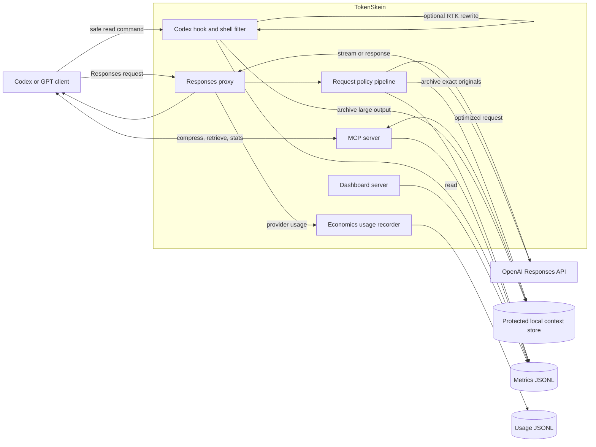
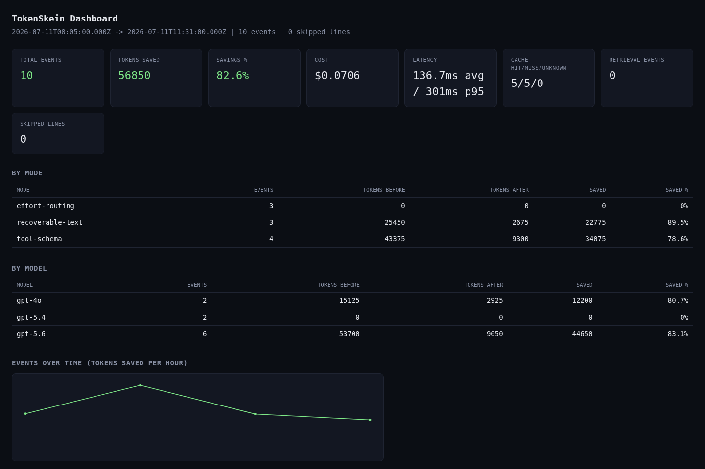

# TokenSkein

TokenSkein is a local context-economy gateway for GPT clients and Codex. It combines the useful ideas behind pxpipe, Headroom, RTK, and Caveman-style output discipline without pretending that every optimization helps every request.

The name combines **token** with **skein**: schemas, recovered text, image pages, shell output, style, and reasoning are separate strands managed as one measured bundle.

The working MVP can:

- proxy OpenAI Responses API requests;
- compact tool schemas and older tool outputs;
- archive every compacted output locally so exact text remains retrievable;
- expose compression, retrieval, and statistics over MCP;
- route reasoning effort from task complexity;
- inject a concise-output policy with safety exceptions;
- optionally encode very dense text as PNG pages when an explicit economic gate passes;
- optionally place a safe output filter after RTK for recognized read-only shell commands.

Status: **working experimental MVP**. Text compaction, storage, MCP, routing, proxying, and the shell adapter are implemented and tested. The vision lane is implemented but disabled by default until model-specific A/B evaluation establishes its real cost and quality.

## Why this exists

Context cost has several different causes, so one trick is not enough:

- repeated schemas waste input tokens;
- large logs and JSON consume context even when only a few lines matter;
- verbose responses consume output tokens;
- easy tasks do not always need high reasoning effort;
- dense visual text can sometimes cost fewer model tokens than raw text, but can also damage exactness or cost more;
- lossy compression becomes dangerous when the omitted detail is later needed.

TokenSkein treats those as separate lanes with separate gates. Its core rule is: **compact what is replaceable, retain what is exact, and keep the original recoverable**.

## Architecture



Inside the request policy pipeline, operations run in this order:

1. remove non-operational tool-schema metadata;
2. inject the concise style policy when enabled;
3. select reasoning effort unless the caller already chose one;
4. leave the recent input tail intact;
5. compact eligible older `function_call_output` items;
6. optionally append PNG pages only when model allowlisting and the profitability estimate both pass;
7. forward the transformed request to the configured upstream.

The editable source is [docs/architecture.excalidraw](docs/architecture.excalidraw).

### Module map

| Module | Responsibility |
|---|---|
| `src/proxy.ts` | HTTP/SSE forwarding, local endpoints, request overrides |
| `src/optimize.ts` | Ordered Responses request policy pipeline |
| `src/compact/` | Tool-schema, recoverable-text, and PNG transforms |
| `src/store.ts` | Content-addressed archive, TTL, search, cleanup |
| `src/mcp.ts` | `skein_compress`, `skein_retrieve`, and `skein_stats` |
| `src/shell.ts` | Opt-in Codex hook, RTK delegation, shell-output archive |
| `src/routing.ts` | Prompt-complexity effort selection |
| `src/metrics.ts` | Content-free optimization event aggregation |
| `src/codex.ts` | Non-mutating Codex integration snippets |
| `src/cli.ts` | User-facing command dispatcher |

### Architecture rationale

- **Responses proxy for broad coverage.** Request-level savings should not depend on the model remembering to call a tool.
- **MCP for exact recovery.** A short `skein:<hash>` reference is useful only if omitted context can be fetched on demand.
- **Local-first storage.** Exact tool output stays on the machine, gzip-compressed with `0700` directories and `0600` files. This is access protection, not encryption.
- **Recent-tail preservation.** New observations are more likely to affect the immediate next action and are left untouched.
- **Text lane before vision lane.** Text remains searchable and exact. Vision is a model-dependent optimization, so it is opt-in and has a break-even gate.
- **Deterministic transforms first.** Schema cleanup, line selection, identifier retention, and routing are inspectable and testable. Semantic summarization can be added later behind evaluation gates.
- **Strict shell allowlist.** Hook rewriting is limited to recognized read/verification commands. Destructive, compound, redirected, or ambiguous commands are not rewritten or auto-approved.
- **Measurement without inflated claims.** Current statistics are tokenizer-based estimates. Provider-reported usage and cache-aware dollar accounting are planned.

## Dashboard



The dashboard reads the same metrics JSONL used by `token-skein stats` and renders estimated token savings, cost and latency where recorded, cache hit/miss counts, and an hourly series, broken down by optimization mode and model. Start it with `bun run dashboard` (equivalent to `bun run src/dashboard.ts`); it listens on `127.0.0.1:8790` by default, overridable with `TOKEN_SKEIN_DASHBOARD_PORT`. It binds to loopback only and is not reachable over the network.

## What was ported

The implementation is a TypeScript/Bun reimplementation of selected concepts, not a concatenation of the original projects.

| Source | Useful idea | TokenSkein status |
|---|---|---|
| pxpipe | Render dense text into image pages | Implemented, opt-in |
| pxpipe | Model allowlist and profitability threshold | Implemented |
| pxpipe | Preserve a recent exact-text tail | Implemented for Responses input items |
| Headroom | Compress-cache-retrieve lifecycle | Implemented with content-addressed local storage |
| Headroom | TTL, cleanup, targeted retrieval, stats | Implemented |
| Headroom | Compact verbose tool schemas | Implemented recursively |
| Headroom | MCP compression/retrieval interface | Implemented with structured output |
| RTK | Rewrite supported commands before execution | Implemented as optional `rtk rewrite` delegation |
| RTK | Reduce noisy shell output | Implemented with exact archive recovery |
| Caveman | Short answers without losing technical substance | Implemented as a configurable instruction |
| Caveman | Bypass terse style for safety and irreversible actions | Preserved in the style policy |
| Global Claude setup | Progressive disclosure and task-based model effort | Implemented as recovery-on-demand plus effort routing |
| Global Claude setup | Durable global instruction layer | Optional Codex `AGENTS.md` fragment included |

The optional prompt fragment lives at [integrations/codex/AGENTS.token-skein.md](integrations/codex/AGENTS.token-skein.md). It is intentionally small: moving a large global `CLAUDE.md` wholesale would spend the context this project is meant to save.

## Planned ports and extensions

The prioritized backlog is tracked in [PLAN.md](PLAN.md). The main planned work is:

- use provider-reported input, cached-input, image-input, reasoning, and output usage;
- build a repeatable A/B harness for correctness, exact identifiers, latency, and cost;
- add streaming-aware response accounting without buffering SSE;
- add session-aware history compaction instead of only item-age rules;
- tune visual pages per model and reject OCR-hostile or exactness-critical content;
- add native shell reducers so RTK remains optional rather than required;
- add MCP resources and indexed retrieval for large archives;
- evaluate other provider protocols only after the Responses path is stable.

## Quick start

Requirements: Bun 1.3+ and an OpenAI API key for the default upstream.

```bash
cd ~/projects/token-skein
bun install
bun run check
bun run proxy
```

The default proxy listens on `http://127.0.0.1:8788` and forwards to `https://api.openai.com`. It does not copy or store API keys; authorization headers are forwarded in memory.

For a generic Responses client, point its OpenAI base URL at:

```text
http://127.0.0.1:8788/v1
```

### Codex integration

Print integration snippets without changing global configuration:

```bash
bun run src/cli.ts codex-snippet
```

Then:

1. merge the provider and MCP blocks into `~/.codex/config.toml`;
2. select `model_provider = "token_skein"` globally or in the profile where it should run;
3. merge the hook block into `~/.codex/hooks.json` only if the experimental shell lane is wanted;
4. after reviewing its strict allowlist, set `shell.enabled` to `true` for that opt-in lane;
5. start `bun run proxy` before starting that Codex profile;
6. ensure `OPENAI_API_KEY` is available to Codex.

This path uses OpenAI API-key billing. It does **not** claim to tunnel ChatGPT/Codex subscription authentication through a custom provider. WebSocket Responses transport is currently disabled; HTTP and SSE are forwarded.

The Codex hook adapter targets the `Bash` `PreToolUse` shape. Codex builds that expose shell execution only through another tool name will still benefit from the proxy and MCP lanes, but will not use the shell rewrite until an adapter for that tool shape is added.

### Optional global instruction fragment

Review [integrations/codex/AGENTS.token-skein.md](integrations/codex/AGENTS.token-skein.md), then merge only the rules you want into `~/.codex/AGENTS.md`. TokenSkein never edits that global file automatically.

## Configuration

The default config path is `~/.config/token-skein/config.json`. Start from [token-skein.config.example.json](token-skein.config.example.json). Nested values are merged over defaults.

Environment overrides:

| Variable | Purpose |
|---|---|
| `TOKEN_SKEIN_CONFIG` | Alternate JSON config path |
| `TOKEN_SKEIN_HOST` | Proxy bind host |
| `TOKEN_SKEIN_PORT` | Proxy port |
| `TOKEN_SKEIN_UPSTREAM` | Upstream API origin |
| `TOKEN_SKEIN_STORE_DIR` | Local archive directory |
| `TOKEN_SKEIN_EVENTS_PATH` | Metrics JSONL path |
| `TOKEN_SKEIN_BIN` | Exact command used by the hook wrapper |
| `TOKEN_SKEIN_DASHBOARD_PORT` | Dashboard bind port (default `8790`), read directly by `bun run dashboard` |

The archive quota is a config file field, not an environment variable: `archive.maxBytes` (default 200 MiB) caps the local context store, and once exceeded the least-recently-touched entries are evicted first.

Request-level controls:

| Header | Accepted values | Effect |
|---|---|---|
| `x-token-skein-bypass` | `true` / `false` | Skip all request transforms |
| `x-token-skein-vision` | `true` / `false` | Override the vision switch for this request |
| `x-token-skein-style` | `true` / `false` | Override concise-style injection |
| `x-token-skein-effort` | `low`, `medium`, `high`, `xhigh` | Explicit reasoning effort |

Vision defaults to off. Enabling it is only a request to evaluate the lane: content must still exceed `minimumBytes`, the model must match `vision.models`, and estimated text tokens divided by estimated image tokens must exceed `minimumSavingsRatio`.

## CLI

```text
token-skein proxy                 start the local Responses proxy
token-skein mcp                   start the stdio MCP server
token-skein hook codex            process a PreToolUse event from stdin
token-skein shell --encoded DATA  execute a hook-approved command and filter output
token-skein stats                 show estimated savings and archive statistics
token-skein cleanup               remove expired archive entries
token-skein codex-snippet         print Codex integration snippets
token-skein install               install the Codex integration (transactional)
token-skein uninstall             remove the Codex integration
token-skein doctor                check prerequisites for the Codex integration
token-skein verify                validate an existing install without mutating anything
token-skein config                print active configuration
```

Until the package is linked globally, replace `token-skein` with `bun run src/cli.ts`.

The dashboard (`bun run dashboard`) and the license scanner (`bun run license-scan`) are separate Bun scripts, not `token-skein` subcommands.

## MCP tools

- `skein_compress`: archive exact content and return a compact view plus reference;
- `skein_retrieve`: fetch the exact original or matching lines with context;
- `skein_stats`: aggregate optimization and archive metrics.

The MCP server uses stdio and emits protocol traffic only on stdout; diagnostics go to stderr.

## Data and security boundaries

- Archive objects contain original tool output and may contain secrets. They are local, gzip-compressed, permission-restricted, and TTL-bound, but **not encrypted**.
- Compacted views redact common API-key, authorization, token, secret, and password forms. The exact archive intentionally retains the original for recovery.
- Metrics record sizes, token estimates, mode, model, references, and non-content metadata; they do not intentionally record request or output bodies.
- The proxy binds to loopback by default. Binding it to a network interface requires your own authentication and transport controls.
- The shell hook is disabled by default. When explicitly enabled, it never rewrites commands containing destructive patterns, command chaining, redirects, heredocs, command substitution, dangerous reducer flags, or newlines. A non-match falls back to normal Codex behavior.

## Known limitations

- Savings are estimates from an `o200k` tokenizer, not invoice-grade measurements.
- Image token cost varies by model, image detail policy, page density, and pricing. PNG can be cheaper, equal, or more expensive than text.
- Text-in-image is lossy for exact punctuation and identifiers. The text sidecar and archive reduce that risk but do not make vision exact.
- Only older `function_call_output` strings are compacted automatically; arbitrary conversation history is not yet rewritten.
- Visual pages are capped. Omitted material remains available through the archive.
- The current effort router is heuristic and English-biased.
- The proxy has no distributed store, encryption-at-rest, or multi-user isolation.

## Verification

```bash
bun run typecheck
bun test
```

Tests cover storage and expiry, recoverable text compaction, tool-schema compaction, effort routing, vision gating, shell safety, and end-to-end proxy transformation through a mock upstream.

## License and attribution

TokenSkein is licensed under Apache-2.0. It adapts concepts from pxpipe (MIT), Headroom (Apache-2.0), RTK (Apache-2.0), and the user's global Claude workflow. See [NOTICE](NOTICE) and [LICENSES/README.md](LICENSES/README.md).
